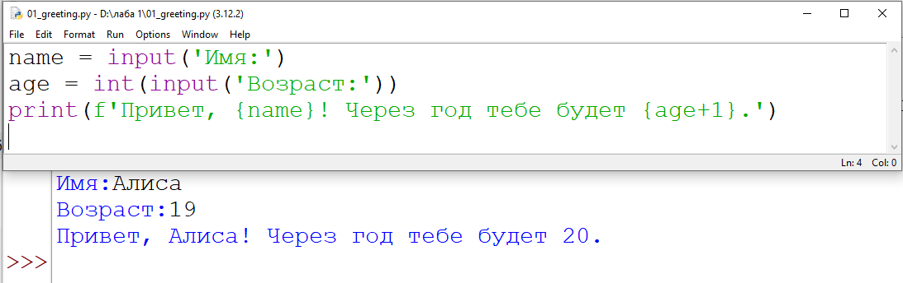

Лабораторная работа [№1](src/lab01) \
Фотографии к [лабораторной работе №1](images/lab01)
= 
>
>
Лабораторная работа [№2](src/lab02) \
Фотографии к [лабораторной работе №2](images/lab02)
=

Задание 1
Ввод:имя(строка,которая вводится пользователем), возраст(вводим строку,которая становится целым числом).\
>
Вывод: имя и возраст с клавиатуры (возраст с увеличением на +1).

### 
### 

Задание 2
Ввод:вещественные числа а и б,допускаются точка или запятая(но мы заменяем запятую на точку,\
т.к. запятая не является разделителем целой и дробной части вещественных чисел.\
>
Вывод: сумму а+б и среднее арифметическое этих чисел.
### 
Задание 3
Ввод: цена, скидка, НДС(строки вводятся пользователем и преобразуются в целое число).\
Далее вводим новые переменные с определёнными формулами: base = price * (1 - discount/100),\
vat_amount = base * (vat/100),total = base + vat_amount.\
>
Вывод: по строкам (в три столбика), 2 знака после запятой.
### 
Задание 4
Ввод: переменная m - целые минуты(вводим с клавиатуры).\
Часы(используем целочисленное деление m//60),минуты(нужен остаток от деления m%60).\
>
Вывод: m//60:m%60 => ЧЧ:ММ.
### 
Задание 5
Ввод: вводим с клавиатуры ФИО, далее программа выводит инициалы.\
Удаляем лишние пробелы в начале и конце строки, разбиваем строку на части b и считаем длину строки.\
>
Вывод: выше инициалы,а ниже длину строки без лишних пробелов.
### 

>
>
Лабораторная работа [№3](src/lab03)\
Фотографии к [лабораторной работе №3](images/lab03)
=
>
>
Лабораторная работа [№4](src/lab04) \
Фотографии к [лабораторной работе №4](images/lab04)
=
>
